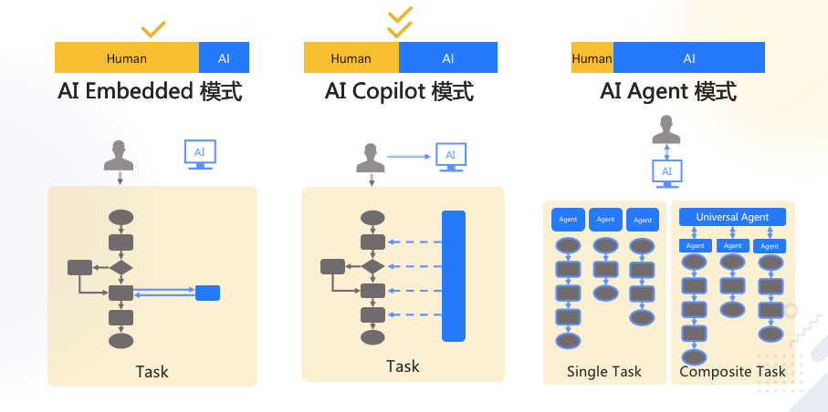
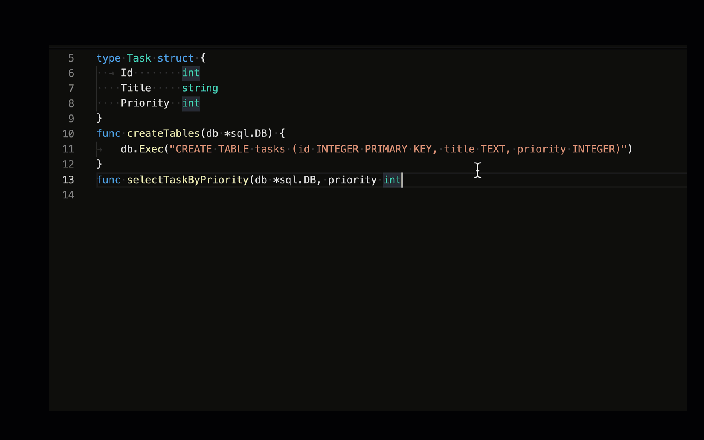
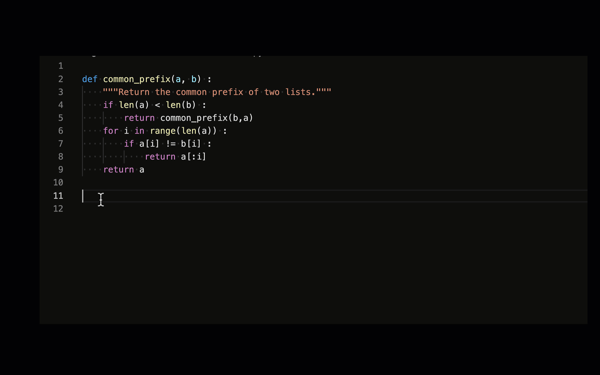
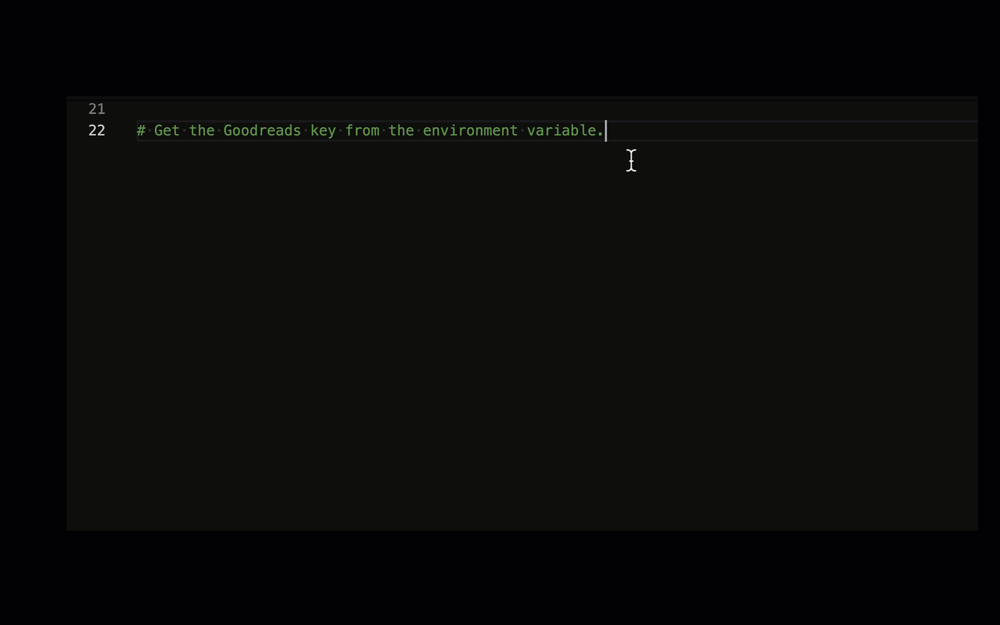
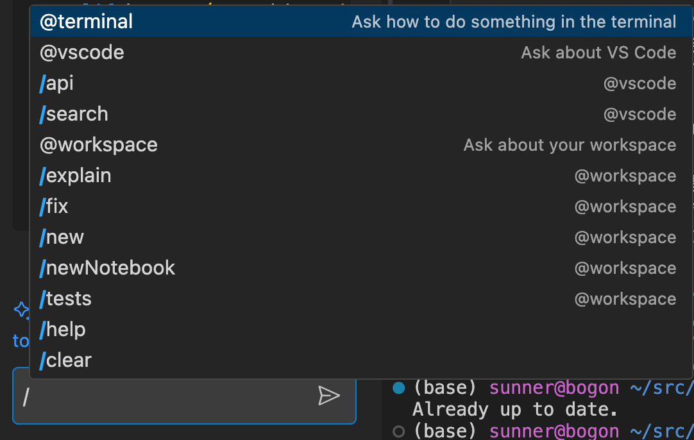
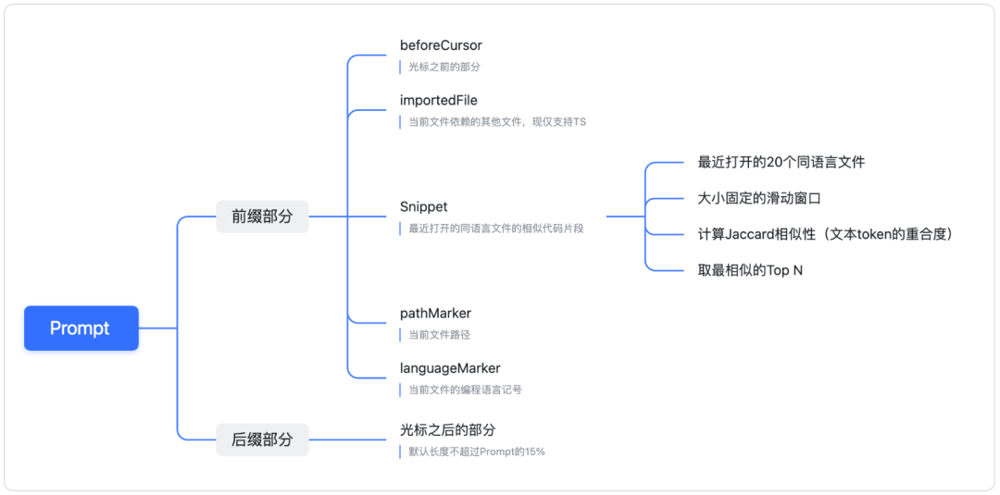
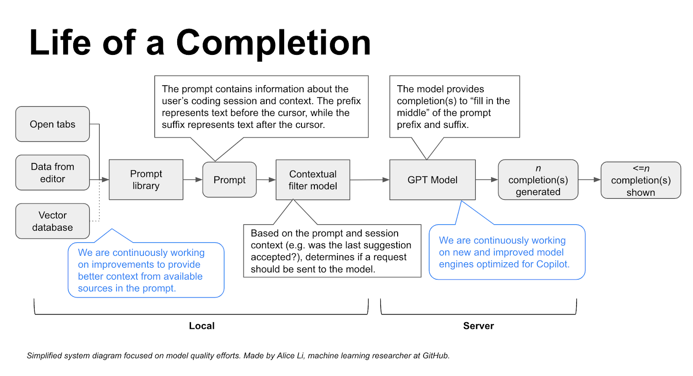
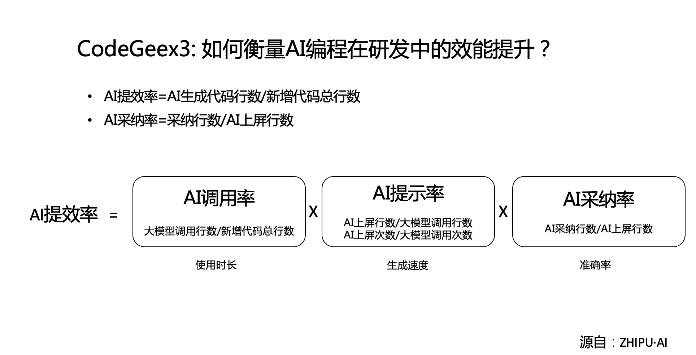

# 从 AI 编程认知 AI


1. 通过 AI 编程，洞察 AI 的能力本质
2. 学习成熟的 AI 产品设计经验
3. 了解 AI 编程的原理，触类旁通其它应用场景
4. 编程新手：了解十倍提升学习、编码效率的工具


## 认知 AI 最好的方式，是天天用

问自己两个问题：

1. 我时间都消耗在哪里？
2. 怎么让 AI 帮我省时间？

<div class="alert alert-success">
<b>划重点：</b>
<ol>
<li>凡是重复脑力劳动都可以考虑 AI 化</li>
<li>凡是「输入和输出都是文本」的场景，都值得尝试用大模型提效</li>
</ol>
</div>


### 场景

其中在软件开发过程中，已验证能明确提效（非代替人）的场景：

<table border="1" align="left">
    <tr>
        <th>阶段</th>
        <th>相关岗位</th>
        <th>活动</th>
    </tr>
    <tr>
        <td rowspan="2">市场调研</td>
        <td>市场分析师</td>
        <td>市场调研</td>
    </tr>
    <tr>
        <td>技术经理</td>
        <td>技术选型</td>
    </tr>
    <tr>
        <td rowspan="3">需求分析</td>
        <td>产品经理</td>
        <td>需求分析</td>
    </tr>
    <tr>
        <td>产品经理</td>
        <td>PRD 撰写</td>
    </tr>
    <tr>
        <td>产品经理</td>
        <td>产品：写用户故事</td>
    </tr>
    <tr>
        <td rowspan="4">设计</td>
        <td>UI/UX 设计师</td>
        <td>图形元素绘制</td>
    </tr>
    <tr>
        <td>前端开发工程师</td>
        <td>从设计图生成代码</td>
    </tr>
    <tr>
        <td>前端/后端开发工程师</td>
        <td>API 文档调用</td>
    </tr>
    <tr>
        <td>系统架构师</td>
        <td>协议解析</td>
    </tr>
    <tr>
        <td rowspan="5">开发</td>
        <td>软件开发工程师</td>
        <td>从需求文本生成代码</td>
    </tr>
    <tr>
        <td>软件开发工程师</td>
        <td>代码审查</td>
    </tr>
    <tr>
        <td>软件开发工程师</td>
        <td>跨语言迁移</td>
    </tr>
    <tr>
        <td>软件开发工程师</td>
        <td>解读遗留代码</td>
    </tr>
    <tr>
        <td>软件测试工程师</td>
        <td>编写测试用例</td>
    </tr>
    <tr>
        <td>运维</td>
        <td>运维工程师</td>
        <td>运维</td>
    </tr>
</table>

方法可以简化成一句话：**用 ChatGPT4，Claude-3.5** 。

除了软件开发编程的过程，还能显著提效的场景：撰写标书、营销文案、宣传图片、LOGO、商标等等周边场景


### 使用技巧

- 所有 prompt engineering 的技巧都有效，可以把**代码**、**错误信息**、**环境信息**直接粘贴进去
- 任何技术相关的问题都可以问，比自己搜索效率高很多
- 注意每次问答上下文窗口的大小

### Copilot 的几个含义




<div class="alert alert-warning">
<b>容易混淆的概念</b>
<ul>
    <li>Microsoft Copilot：微软的一系列产品，从 Office、Windows、Edge 到 Bing 搜索都标配</li> 
    <li>GitHub Copilot：GitHub 平台和 OpenAI 合作的编程助手</li>
    <li>AI Copilot：产品范式</li>
</ul>
</div>


## GitHub Copilot 介绍

[GitHub Copilot](https://github.com/features/copilot) 创造了一个奇迹：

**所有竞争对手（Amazon、Google、Meta、阿里巴巴、腾讯等）都是免费的，每月 10-20 美元的 Copilot 仍市占率最高。**

不使用它只有一个理由：保密自己的代码。

这是一个能提升**幸福感**的工具，随时都有 Aha! 时刻。

几个事实：

- 2021 年 6 月上线，比 ChatGPT 早近一年半
- GitHub 统计：
  - 88% 的用户获得效率提升
  - 平均 46% 的代码由它完成
  - 平均效率提升 55%（网易内部统计 38%，根据需求燃尽图和速度统计得知）
- 个人版 10 美元/月，商业版 19 美元/月，企业版 39 美元/月 


### 安装

1. 首先，需要有 GitHub 账号
2. 然后，到 https://github.com/settings/copilot 启用
3. 最后，安装 IDE 插件，比如
   - VSCode: https://marketplace.visualstudio.com/items?itemName=GitHub.copilot
   - PyCharm: https://plugins.jetbrains.com/plugin/17718-github-copilot
   - Xcode : https://github.com/intitni/CopilotForXcode

注意：要全局科学上网才能正常使用


### 刷刷写代码

Copilot 的使用其实不需要学习……正常写代码，就会收获不断的惊喜。

它根据上下文，自动生成建议代码。如果觉得合适，按下 tab 就行了。比如：


#### 完成整个函数




#### 写测试用例




#### 根据注释写代码



但这种用法不太推荐，因为注释里针对 AI 而写的 prompt，并不适合人类阅读。

如果想从需求生成代码，更推荐后面介绍的「Copilot Chat」 或者直接使用 ChatGPT 4 问答


#### 一些技巧

1. 代码有了，再写注释，更省力
2. 改写当前代码，可另起一块新写，AI 补全得更准，完成后再删旧代码
3. `Cmd/Ctrl + →` 只接受一个 token
4. 如果有旧代码希望被参考，就把代码文件在新 tab 页里打开


### GitHub Copilot Chat

- 背后是 GPT-4o

官方使用演示：修复一个函数的 Bug

<video src="Copilot-Chat-Debug-Blog.mp4" controls="controls" width="100%" height="auto" preload="none"></video>

敲「/」可以看到特殊指令：



VS 中选中要操作的代码，或者光标停留在想插入代码的地方，按 `Cmd/Ctrl + i`，可以内嵌呼出 Copilot chat：

<video src="CopilotChatVSInlineRefinement.mp4" controls="controls" width="100%" height="auto" preload="none"></video>


### 命令行的 Copilot

* 先要安装 GitHub CLI：https://cli.github.com/

* !第一次使用需要命令行登录: https://github.com/github/gh-copilot
```
gh auth login --web -h github.com #登录
gh extension install github/gh-copilot --force #升级
```

* 然后：

```bash
gh copilot suggest 怎样把 python 的 openai 库升级到最新
gh copilot explain "rm -rf /*"
```


### 生成 git commit message

### 一些其它使用方式

[10 unexpected ways to use GitHub Copilot](https://github.blog/2024-01-22-10-unexpected-ways-to-use-github-copilot/)


### 故事线

- 一个小转折：Copilot 从最开始的只用问答，到取消问答使用补全，到恢复问答。

<div class="alert alert-success">
<b>产品设计经验：</b>让 AI 在不影响用户原有工作习惯的情况下切入使用场景，接受度最高。 
</div>


## GitHub Copilot 基本原理


### 工作原理

- 模型层：最初使用 OpenAI Codex 模型，它也是 GPT-3.5、GPT-4 的「一部分」。最新支持模型 GPT-4o。

- 应用层： prompt engineering。Prompt 中包含：

  1. 组织上下文：光标前和光标后的代码片段
  2. 获取代码片段：其它相关代码片段。当前文件和其它打开的同语言文件 tab 里的代码被切成每个 60 行的片段，用 [Jaccard 相似度](https://zh.wikipedia.org/wiki/%E9%9B%85%E5%8D%A1%E5%B0%94%E6%8C%87%E6%95%B0)评分，取高分的
     - 为什么是打开的 tabs？
     - 多少个 tabs 是有效的呢？经验选择：20 个
  3. 修饰相关上下文：被取用的代码片段的路径。用注释的方式插入，例如：`# filepath: foo/bar.py`，或者 `// filepath: foo.bar.js`
  4. 优先级：根据一些代码常识判断补全输入内容的优先级
  5. 补全格式：在函数定义、类定义、if-else 等之后，会补全整段代码，其它时候只补全当前行

  

- 数据流
  

- 有效性：

  - Telemetry(远程遥测[如何取消](https://docs.github.com/en/site-policy/privacy-policies/github-general-privacy-statement))

  - A/B Test

  - 智谱的度量方式

    

<div class="alert alert-warning">
<b>思考：</b>似乎Github Copilot 在Android Studio等IDE中没有Visual Studio Code好用？
</div>

### 了解更多

- [Inside GitHub: Working with the LLMs behind GitHub Copilot](https://github.blog/2023-05-17-inside-github-working-with-the-llms-behind-github-copilot/)
- [How GitHub Copilot is getting better at understanding your code](https://github.blog/2023-05-17-how-github-copilot-is-getting-better-at-understanding-your-code/)
- [A developer’s guide to prompt engineering and LLMs](https://github.blog/2023-07-17-prompt-engineering-guide-generative-ai-llms/)
- [GitHub Copilot VSCode Extension 逆向工程](https://zhuanlan.zhihu.com/p/639993637)
- [GitHub Copilot 深度剖析](https://xie.infoq.cn/article/06aabd93dc757a1015def6857)


## 还有哪些工具

1. [Tongyi Lingma](https://tongyi.aliyun.com/lingma) -- (插件+模型) 代码补全，免费。阿里云相关。
2. [CodeGeeX](https://codegeex.cn/) -- (插件+模型)清华智谱制造，CodeGeeX 3 Pro 免费可用
3. [Comate](https://comate.baidu.com/zh) -- （插件+模型）百度制造，有免费试用版
4. [MarsCode](https://www.marscode.cn/) -- (插件+ 模型+ 云平台）字节出品
5. [Bito](https://bito.ai/) - （插件）比 Copilot 还多些创新
6. [DevChat](https://www.devchat.ai/) -- （插件) 前端开源，同时卖 GPT 服务
7. [Tabnine](https://www.tabnine.com/) - (插件 + 模型) 代码补全，个人基础版免费
8. [Amazon CodeWhisperer](https://aws.amazon.com/codewhisperer/) - （模型） 代码补全，免费。AWS 相关的编程能力卓越。其它凑合
9. [Zed AI](https://zed.dev/) - （客户端） 开源的可以多人合作，并且支持 Copilot 的编辑器
10. [ell](https://github.com/MadcowD/ell) - （客户端） 提出理念，认为提示词也是代码的一部分，对提示词进行版本跟踪
11. [Cursor](https://www.cursor.so/) - AI first 的 IDE

## 部署自己的 AI 编程工具


### Ollama + Continue 
- Ollama: https://ollama.com/

- Continue: https://www.continue.dev/

### 可本机部署的 Tabby

Tabby：https://tabby.tabbyml.com/

- 全开源
- 可以本机部署，也可以独立本地部署
- 支持所有开源编程模型

### 更多开源编程大模型

1. [Code Llama](https://ai.meta.com/blog/code-llama-large-language-model-coding/) - Meta 出品，可能是开源中最强的 （7B、13B、34B、70B）
2. [DeepSeek-Coder](https://github.com/deepseek-ai/DeepSeek-Coder) - 深度探索公司出品（1B、5.7B、6.7B、33B）
3. [CodeGemma](https://huggingface.co/blog/codegemma) - Google 出品（2B、7B）

## AI 编程的效能


### AI 幻觉的必然性，和 AI 能力的天花板

AI 祖师爷阿兰·图灵 1947 年在[伦敦数学学会的演讲](https://www.vordenker.de/downloads/turing-vorlesung.pdf)上说过：

> ...if a machine is expected to be infallible, it cannot also be intelligent.

翻译成中文是：

> 如果一个机器绝对不会犯错，它就不可能是智能的。

拥有类人的智能，就一定和人类一样，说胡话、瞎话、错话，说有争议的话。

所以，AI 的幻觉不可完全消除，只能尽可能压制。

所以，使用者的判断力，决定了 AI 能力的上限。 就像团队领导，是团队的上限一样。

<div class="alert alert-success">
<h4>AI 能力定律：</h4>
<p>AI 能力的上限，是使用者的判断力</p>
<p>$\text{AI 能力} = \min(\text{AI 能力}, \text{使用者判断力})$ </p>
<h4>AI 提效定律：</h4>
<p>AI 提升的效率，与使用者的判断力成正比，与生产力成反比</p>
<p>$\text{效率提升幅度} = \frac{\text{使用者判断力}}{\text{使用者生产力}}$</p>
</div>

解读：

1. 使用者的判断力，是最重要的
2. 提升判断力，比提升实操能力更重要。所谓「眼高手低」者的福音
3. 广阔的视野是判断力的养料


### 使用 AI 编程需要的注意事项


#### AI 编程貌似严谨实则疏漏的代码


> 请写一个判断输入是否为合法手机号的 JavaScript 正则代码


```javascript
function isValidPhoneNumber(phoneNumber) {
  // 中国大陆的手机号码正则表达式，匹配以1开头，第二位是3-9中的任意一个数字，后面跟着9个数字的模式
  const regex = /^1[3-9]\d{9}$/;
  return regex.test(phoneNumber);
}

// 测试示例
console.log(isValidPhoneNumber("13800138000")); // 应该返回 true
console.log(isValidPhoneNumber("12345678901")); // 应该返回 false
console.log(isValidPhoneNumber("14123456780")); // 应该返回 true  !!!!!
```


[分析了 1.5 亿行代码发现：AI 编程助手降低代码质量](https://www.oschina.net/news/277025/coding-on-copilot-2024-developer-research)

1. 随着 AI 的普及，代码的变更率在提升（变更率是指：今天提交，两周内要修改掉）
2. 生产部署后回退的数量的所谓生产事件数量也在提升；
3. 那些本不应该写的代码，AI 给你提示写了，给阅读的人带来了时间浪费，也是一个问题。


### 趋势

[Atom Capital: 1000x 的超级码农——AI 编程的机会和未来
](https://mp.weixin.qq.com/s/IE1P-USAJDlbPcssJltNnw)

> 在 RAG 方向上建立技术优势，然后转换成更好的产品效果和体验，也成为了一个重要的竞争点。RAG 本身有很高的技术复杂度，而代码领域的 RAG 可能是所有应用领域中最复杂的，会有很多有挑战的子场景需要解决。即使是市占率很高的 GitHub，也很难短时间把大部分问题解决掉，这便给了创业公司机会。
